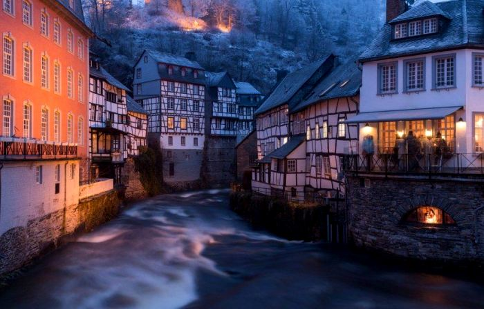
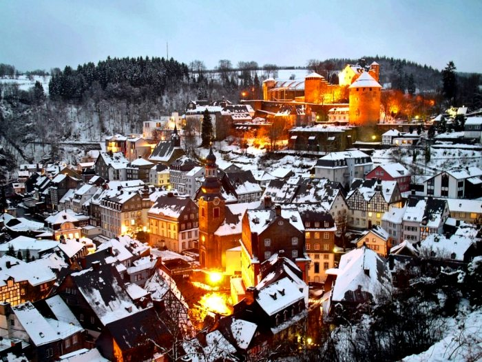
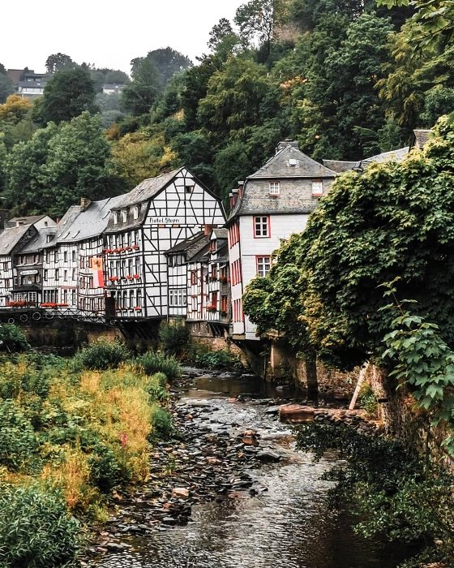
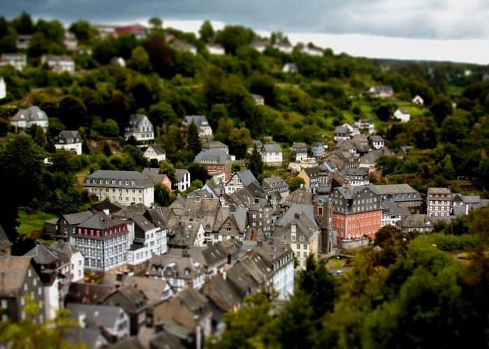

# The city of "gingerbread" houses: How the German town of Monschau has managed not to change over the course of 300 years

In Germany, you can find quite a few towns that have preserved their authentic architecture. But there is one place where the concentration of legendary German "gingerbread" houses is higher than anywhere else. We are talking about the small town of Monschau, a phenomenon which consists of remarkable calm and stability of its existence. And the thing is that nothing has been rebuilt there for three centuries.

- he city of Monschau is located in western Germany, just outside the border with Belgium. The area there is picturesque: in the gorge of the foothills by the flow of the river Ruhr was formed a small peninsula - and it is on it and is located this unique settlement. The river flows literally everywhere: that is, not only between the streets, but the houses themselves are literally washed by the waters of the Ruhr.

In addition, the small area is the reason that the streets in Monchau are quite narrow. And the location in the immediate vicinity of the mountains gave the city two more interesting features: first, it seems to be scattered on the hills, and secondly, no matter how many walks through the streets, it seems that they all lead somewhere upwards.

- The history of Monschau is long and, for the most part, stable. The first mention of the city dates back to 1198. In this case, the information speaks of the existence of the castle of the same name, around which people began to settle. Since the middle of the XV century it became the residence of the Dukes of Julich-Berg. Monchau often changed hands without undergoing significant physical transformation.

It is therefore not surprising that the history of the city has contributed to the main feature of Monchau: the city has almost never been rebuilt in the past three centuries, so it has almost entirely managed to preserve its historic buildings. And this phenomenon is truly a phenomenon, because no other place with a similar number of authentic houses on the territory of modern Germany can be found.

